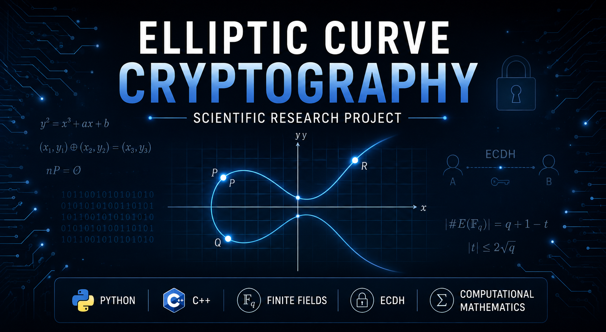

  

# Elliptic Curve Cryptography

## Overview

This repository documents my ongoing research on Elliptic Curve Cryptography (ECC), focusing on mathematical foundations, finite field arithmetic, secure key exchange, and computational implementations.

The project combines concepts from:

- Elliptic Curve Cryptography
- Finite Fields
- Number Theory
- Group Theory
- Computational Mathematics
- Python
- C++
- Data Analysis

---

## Research Topics

- Finite Field Arithmetic
- Elliptic Curves
- Group Operations
- Point Generation
- ECDH
- Frobenius Trace
- Point Counting
- Security Analysis
- Computational Algorithms

---

## Repository Status

🚧 Research in progress.

This repository is continuously updated as the research evolves.

---

## Author

Evandro Erick Leal
